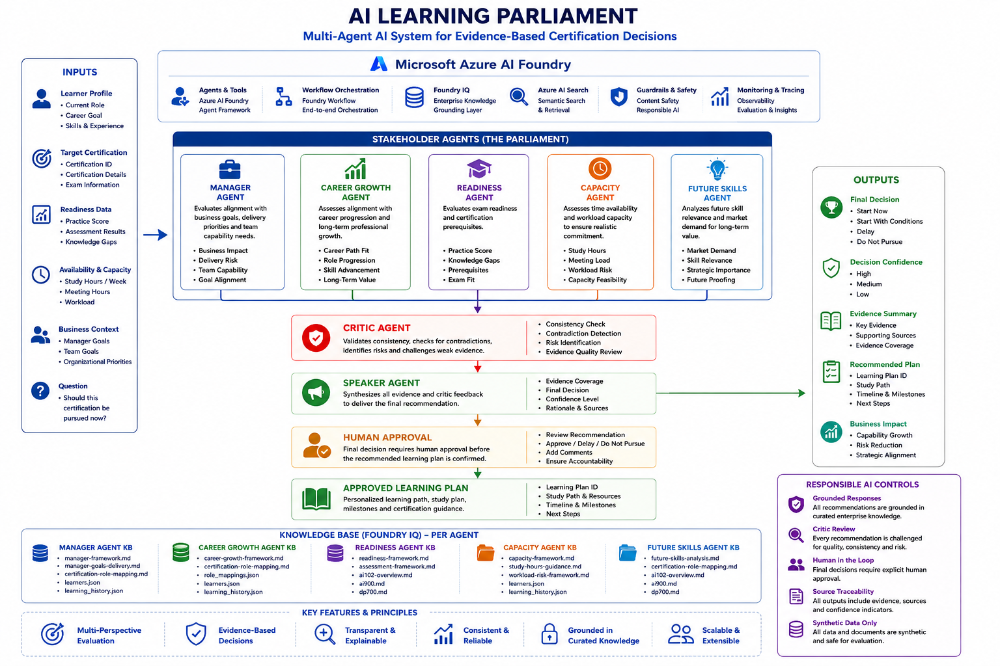

# AI Learning Parliament

## Multi-Agent AI System for Evidence-Based Certification Decisions



---

# Overview

AI Learning Parliament is a multi-agent decision intelligence system built on **Microsoft Azure AI Foundry**.

The platform evaluates employee certification readiness using evidence-based reasoning, workload analysis, assessment results, organizational goals, future skills forecasting, and human approval workflows.

Rather than recommending certifications through static rules, the system simulates a structured AI Parliament where specialized agents debate, validate evidence, challenge assumptions, and produce transparent certification decisions.

The solution is fully grounded using **Microsoft Foundry IQ Knowledge Bases** and synthetic enterprise learning datasets.

---

# Challenge Alignment

This solution addresses enterprise certification planning by helping organizations answer:

* Which certification should an employee pursue?
* Is the employee ready?
* Are workload constraints sustainable?
* Does the certification align with business goals?
* Does the certification remain relevant in the future?
* What are the risks of pursuing the certification now?

The platform produces explainable recommendations supported by evidence and stakeholder reasoning.

---

# Key Capabilities

* Multi-Agent Decision Making
* Evidence-Based Certification Readiness
* Human-in-the-Loop Approval
* Foundry IQ Grounding
* Knowledge-Based Reasoning
* Critic Validation Layer
* Future Skills Analysis
* Workforce Capacity Assessment
* Explainable AI Decisions
* Enterprise Governance Alignment

---

# Solution Architecture

## High-Level Architecture


The architecture combines:

### Inputs

* Learner Profile
* Career Goal
* Current Role
* Certification Target
* Assessment Results
* Workload Signals
* Organizational Objectives

### Stakeholder Agents

* Manager Agent
* Career Growth Agent
* Readiness Agent
* Capacity Agent
* Future Skills Agent

### Validation Layer

* Critic Agent

### Decision Layer

* Speaker Agent

### Outputs

* Certification Recommendation
* Readiness Assessment
* Confidence Score
* Risks
* Mitigations
* Human Approval Request

---

# Multi-Agent Workflow

The orchestration layer is implemented using Azure AI Foundry Workflows.


## Workflow Steps

1. Candidate profile submitted
2. Stakeholder agents evaluate independently
3. Critic Agent validates reasoning
4. Speaker Agent synthesizes final decision
5. Human approval requested
6. Approved recommendation generated

---

# Microsoft Foundry IQ Integration

## Synthetic Enterprise Knowledge Base

The platform uses Foundry IQ as its primary source of truth.

### Azure Blob Storage

Synthetic enterprise datasets and certification knowledge.


### Foundry IQ Knowledge Base

Grounded retrieval and reasoning.


Knowledge includes:

* Certification Guides
* Readiness Frameworks
* Workforce Policies
* Role Mappings
* Learning History
* Assessment Results
* Future Skills Analysis
* Manager Goals

---

# Agent Responsibilities

| Agent               | Responsibility                          |
| ------------------- | --------------------------------------- |
| Manager Agent       | Business priorities and team capability |
| Career Growth Agent | Career alignment and progression        |
| Readiness Agent     | Certification readiness evaluation      |
| Capacity Agent      | Workload sustainability                 |
| Future Skills Agent | Long-term skill relevance               |
| Critic Agent        | Challenge assumptions and detect risks  |
| Speaker Agent       | Final decision synthesis                |

---

# Agent Demonstrations

## Readiness Agent

Evaluates certification readiness using assessment evidence and certification requirements.


---

## Future Skills Agent

Evaluates long-term market relevance and strategic value.


---

## Critic Agent

Validates stakeholder reasoning and identifies contradictions.


### Responsibilities

* Detect unsupported conclusions
* Identify risks
* Challenge assumptions
* Validate evidence quality

---

## Speaker Agent

Produces the final executive decision report.


The Speaker Agent provides:

* Stakeholder Voting Summary
* Parliament Outcome
* Consensus Score
* Decision Confidence
* Risks
* Recommended Actions
* Final Recommendation

---

# Human-in-the-Loop Approval

A core design principle of the platform is that AI recommendations are never automatically executed.

Human approval is required before learning plans are generated.


This creates a governance layer suitable for enterprise environments.

---

# Example Scenario — Positive Outcome

Candidate:

* Infrastructure Project Manager
* Career Goal: AI Transformation Lead
* Practice Score: 82%
* Moderate Workload

Outcome:

* Strong readiness
* Strong capacity
* Strong business alignment

Final Decision:

**Start Now**


---

# Example Scenario — Risk-Based Outcome

Candidate:

* AI Engineer
* AI-900
* High workload
* Low assessment scores
* Insufficient study capacity

Outcome:

* Significant readiness gaps
* Capacity concerns
* Elevated certification risk

Final Decision:

**Start with Conditions** or **Delay**


---

# Agent Configuration

Each agent contains:

* Dedicated role instructions
* Foundry IQ grounding
* Evidence retrieval rules
* Output constraints


This ensures:

* Consistency
* Explainability
* Traceability
* Reduced hallucination risk

---

# Responsible AI

The solution follows Responsible AI principles:

* Human Oversight
* Explainability
* Traceability
* Evidence-Based Reasoning
* Grounded Retrieval
* Synthetic Data Only
* Transparent Decision Making

---

# Evaluation Criteria Mapping

| Hackathon Requirement     | Status |
| ------------------------- | ------ |
| Multi-Agent System        | ✅      |
| Azure AI Foundry          | ✅      |
| Microsoft IQ Layer        | ✅      |
| Reasoning & Planning      | ✅      |
| Stakeholder Collaboration | ✅      |
| Synthetic Data            | ✅      |
| Human Approval            | ✅      |
| Explainable Decisions     | ✅      |
| Critic Validation         | ✅      |
| Grounded Knowledge        | ✅      |
| Enterprise Scenario       | ✅      |

---

# Technology Stack

## Microsoft Technologies

* Azure AI Foundry
* Foundry IQ
* Azure Blob Storage
* Azure AI Agents
* Azure AI Workflows

## AI Components

* Multi-Agent Architecture
* Critic Validation Pattern
* Speaker Synthesis Pattern
* Human Approval Workflow
* Knowledge Grounding

---

# Repository Structure

```text
AI-Learning-Parliament/
│
├── README.md
│
├── docs/
│   └── screenshots/
│       ├── architecture.png
│       ├── workflow.png
│       ├── blob-storage.png
│       ├── foundry-kb.png
│       ├── readiness-agent.png
│       ├── future-skills-agent.png
│       ├── critic-agent.png
│       ├── speaker-agent.png
│       ├── human-approval.png
│       ├── positive-case.png
│       ├── risk-case.png
│       └── agent-config.png
│
├── knowledge-base/
├── workflow/
├── agents/
└── documentation/
```

---

# Future Enhancements

* Real-time certification catalogs
* Enterprise LMS integration
* Manager dashboards
* Agent observability
* Evaluation pipelines
* Learning plan generation workflows
* Organizational readiness analytics

---

# Conclusion

AI Learning Parliament demonstrates how Microsoft Azure AI Foundry can be used to create explainable, grounded, and enterprise-ready multi-agent systems.

By combining stakeholder reasoning, validation layers, Foundry IQ grounding, and human approval workflows, the platform delivers transparent certification decisions that organizations can trust.
