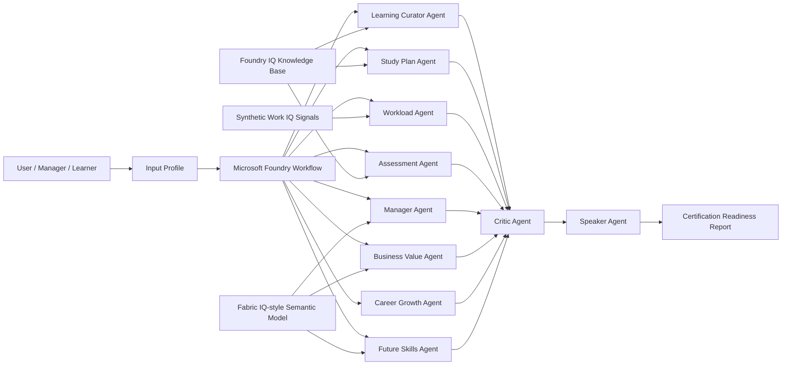

# AI Learning Parliament

**A multi-agent governance system for certification readiness and enterprise learning decisions.**

AI Learning Parliament helps organisations recommend realistic and responsible certification journeys by balancing learner goals, business priorities, workload capacity, skills demand, assessment readiness, and compliance constraints.

The solution was designed for the **AI Skills Fest 2026 - Agents League Hackathon**, Track: **Reasoning Agents with Microsoft Foundry**.

---

## Problem

Enterprise learning programmes often fail because certification decisions are made from a single perspective:

- learners want career growth;
- managers need team readiness;
- organisations need business value;
- certification teams need compliance;
- employees have limited work capacity.

AI Learning Parliament turns certification planning into a multi-agent reasoning process.

---

## Solution

The system uses specialised agents that debate the best certification path and produce a final **Certification Readiness Report**.

### Agents

1. **Learning Curator Agent** — maps role and target certification to grounded learning content.
2. **Study Plan Agent** — converts content into a practical study schedule.
3. **Workload Agent** — checks workload, meeting load and available focus time.
4. **Assessment Agent** — evaluates readiness and learning gaps.
5. **Manager Agent** — represents team capacity and operational needs.
6. **Business Value Agent** — evaluates ROI and organisational value.
7. **Career Growth Agent** — represents learner aspirations and career progression.
8. **Future Skills Agent** — assesses future relevance of skills.
9. **Critic Agent** — challenges assumptions and identifies contradictions.
10. **Speaker Agent** — synthesises all perspectives into a final decision report.

---

## Microsoft Technologies

- Microsoft Foundry
- Foundry Agents
- Foundry Workflows
- Foundry IQ
- Azure AI Search
- Azure OpenAI / GPT models
- Optional: Microsoft Learn MCP Server
- Optional: Work IQ-style synthetic work signals
- Optional: Fabric IQ-style semantic model

---

## Architecture



---

## Demo Input Example

```text
Role: Cloud Engineer
Target Certification: AI-102
Current Skills: Azure basics, Python, API development
Available Study Hours: 4 hours/week
Workload: 21 meeting hours/week, 8 focus hours/week
Career Goal: Move into AI Engineering
Team Goal: Increase GenAI delivery capability within 3 months
```

---

## Expected Output

- Recommended certification
- Readiness score
- Consensus score
- Study plan
- Risk analysis
- Manager insights
- Critic validation
- Next steps

---

## Responsible AI

This project uses only synthetic data and synthetic documents. No real employee data, customer data, credentials, confidential information or PII should be included.

See [`docs/responsible-ai.md`](docs/responsible-ai.md).

---

## Repository Structure

```text
architecture/       Architecture diagrams and Mermaid flows
agents/             Agent prompts and responsibilities
workflow/           Microsoft Foundry workflow YAML
demo/               Sample inputs and outputs
docs/               Business, technical and responsible AI documentation
data/synthetic/     Synthetic datasets and demo documents
src/                Optional Python/Streamlit wrapper
screenshots/        Foundry and demo screenshots
```
