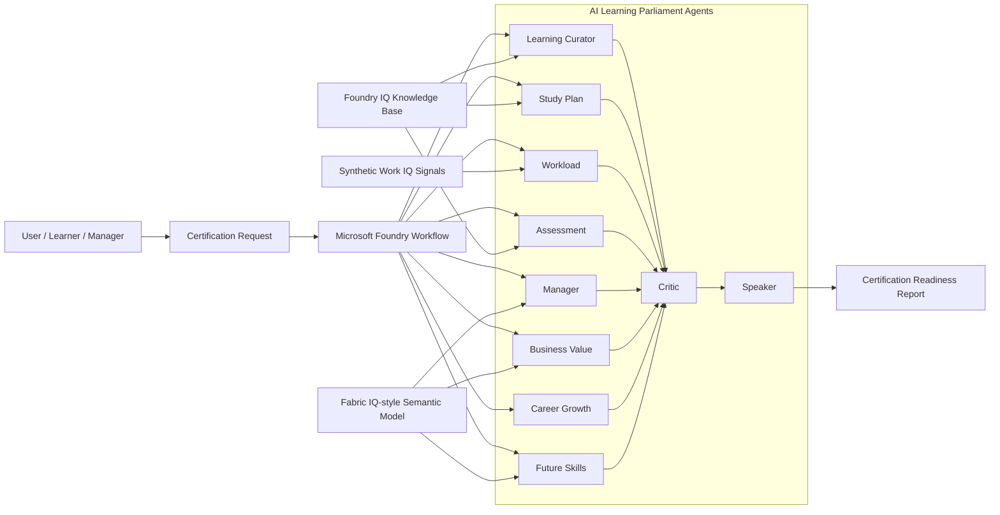

# Architecture Diagram

```mermaid
flowchart LR
    U[User / Learner / Manager] --> P[Certification Request]
    P --> WF[Microsoft Foundry Workflow]

    subgraph Agents[AI Learning Parliament Agents]
        LC[Learning Curator]
        SP[Study Plan]
        WL[Workload]
        AS[Assessment]
        MA[Manager]
        BV[Business Value]
        CG[Career Growth]
        FS[Future Skills]
        CR[Critic]
        SK[Speaker]
    end

    WF --> LC
    WF --> SP
    WF --> WL
    WF --> AS
    WF --> MA
    WF --> BV
    WF --> CG
    WF --> FS

    LC --> CR
    SP --> CR
    WL --> CR
    AS --> CR
    MA --> CR
    BV --> CR
    CG --> CR
    FS --> CR

    CR --> SK
    SK --> OUT[Certification Readiness Report]

    FIQ[Foundry IQ Knowledge Base] --> LC
    FIQ --> AS
    FIQ --> SP

    WIQ[Synthetic Work IQ Signals] --> WL
    FAB[Fabric IQ-style Semantic Model] --> MA
    FAB --> BV
    FAB --> FS
```
