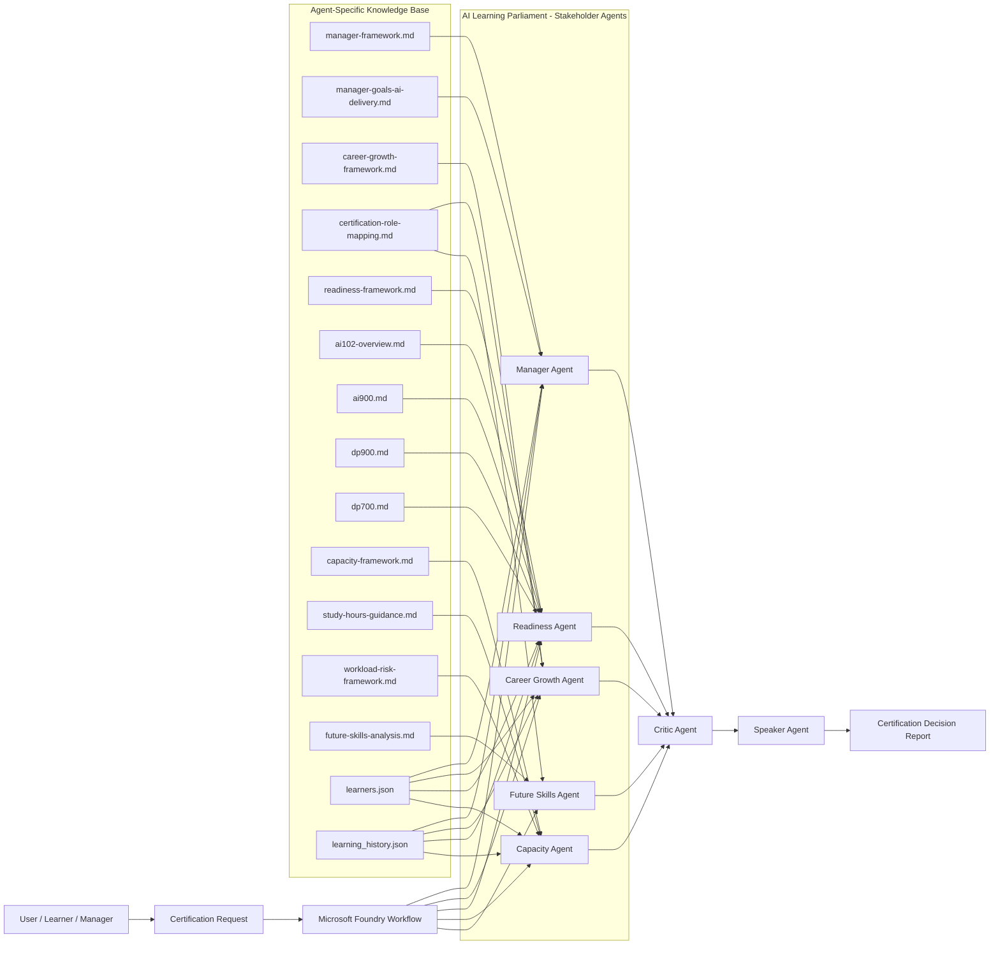

# Architecture Diagram

```mermaid
flowchart LR
    U[User / Learner / Manager] --> P[Certification Request]
    P --> WF[Microsoft Foundry Workflow]

    subgraph Agents[AI Learning Parliament - Stakeholder Agents]
        MA[Manager Agent]
        CG[Career Growth Agent]
        RA[Readiness Agent]
        CA[Capacity Agent]
        FS[Future Skills Agent]
    end

    WF --> MA
    WF --> CG
    WF --> RA
    WF --> CA
    WF --> FS

    MA --> CR[Critic Agent]
    CG --> CR
    RA --> CR
    CA --> CR
    FS --> CR

    CR --> SP[Speaker Agent]
    SP --> OUT[Certification Decision Report]

    subgraph KB[Agent-Specific Knowledge Base]
        MF[manager-framework.md]
        MG[manager-goals-ai-delivery.md]

        CF[career-growth-framework.md]
        RM[certification-role-mapping.md]

        RF[readiness-framework.md]
        AI[ai102-overview.md]
        A900[ai900.md]
        DP900[dp900.md]
        DP700[dp700.md]

        CPF[capacity-framework.md]
        SH[study-hours-guidance.md]
        WR[workload-risk-framework.md]

        FSF[future-skills-analysis.md]

        LJ[learners.json]
        LH[learning_history.json]
    end

    MF --> MA
    MG --> MA
    LJ --> MA
    LH --> MA

    CF --> CG
    RM --> CG
    LJ --> CG
    LH --> CG

    RF --> RA
    AI --> RA
    A900 --> RA
    DP900 --> RA
    DP700 --> RA
    LJ --> RA
    LH --> RA

    CPF --> CA
    SH --> CA
    WR --> CA
    LJ --> CA
    LH --> CA

    FSF --> FS
    RM --> FS
```
