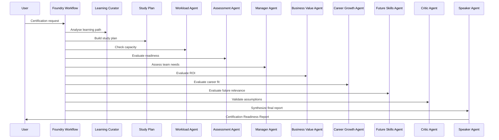

# Workflow Diagram

```mermaid
sequenceDiagram
    participant User
    participant Workflow as Foundry Workflow
    participant Curator as Learning Curator
    participant Planner as Study Plan
    participant Workload as Workload Agent
    participant Assessment as Assessment Agent
    participant Manager as Manager Agent
    participant Business as Business Value Agent
    participant Career as Career Growth Agent
    participant Future as Future Skills Agent
    participant Critic as Critic Agent
    participant Speaker as Speaker Agent

    User->>Workflow: Certification request
    Workflow->>Curator: Analyse learning path
    Workflow->>Planner: Build study plan
    Workflow->>Workload: Check capacity
    Workflow->>Assessment: Evaluate readiness
    Workflow->>Manager: Assess team needs
    Workflow->>Business: Evaluate ROI
    Workflow->>Career: Evaluate career fit
    Workflow->>Future: Evaluate future relevance
    Workflow->>Critic: Validate assumptions
    Workflow->>Speaker: Synthesize final report
    Speaker->>User: Certification Readiness Report
```
